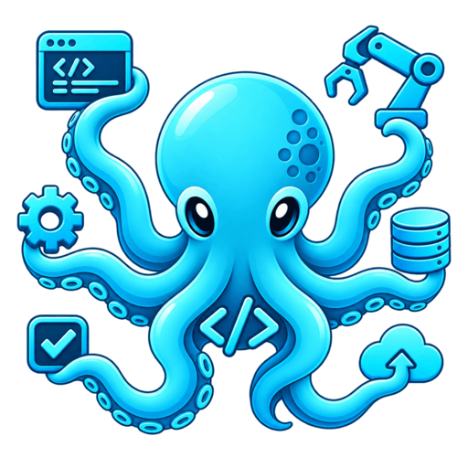
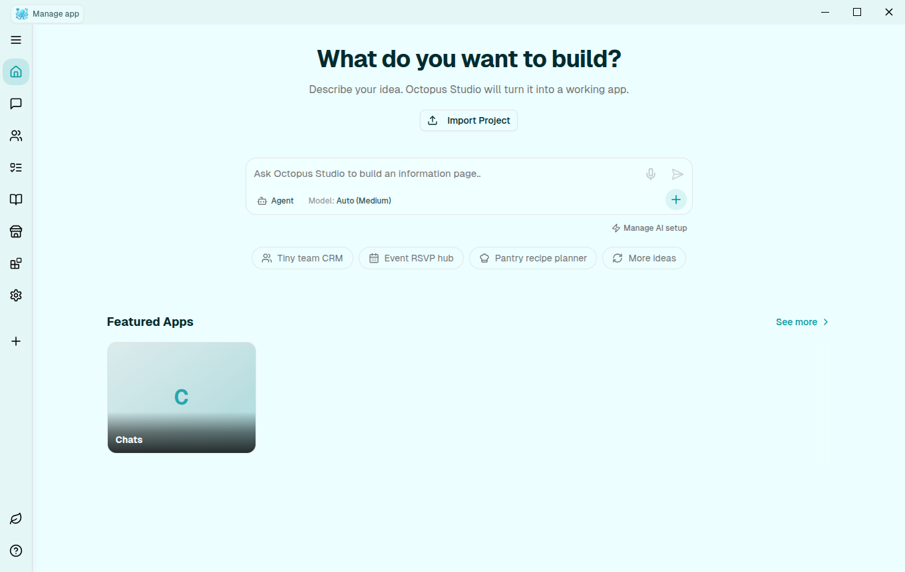
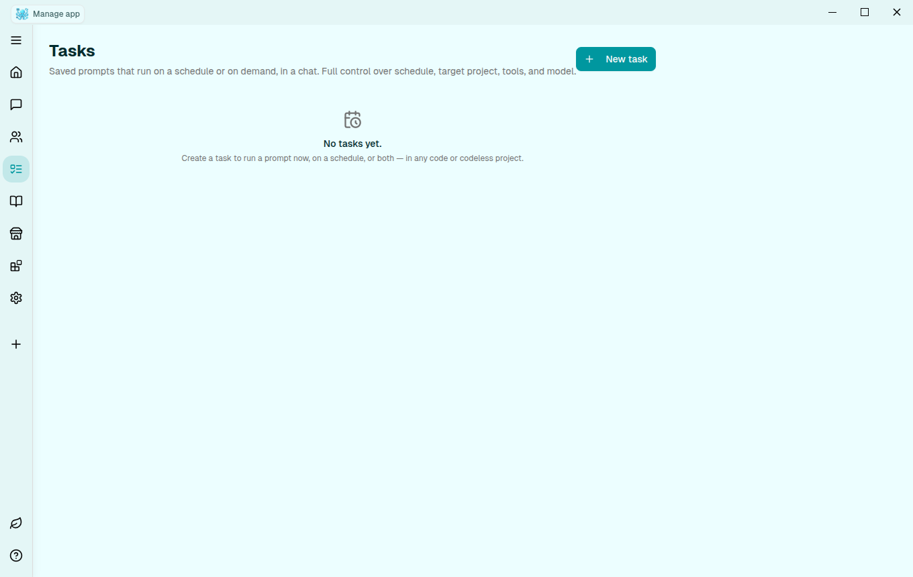
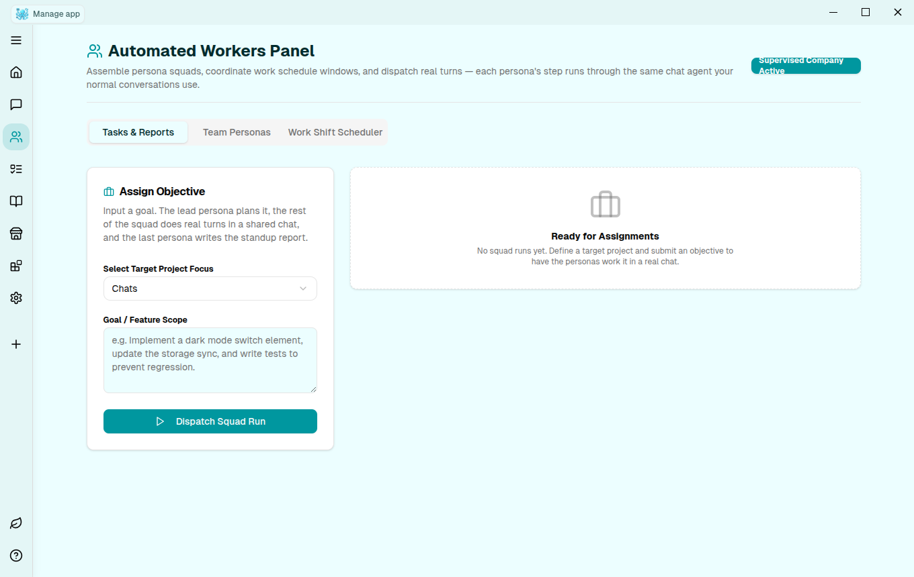
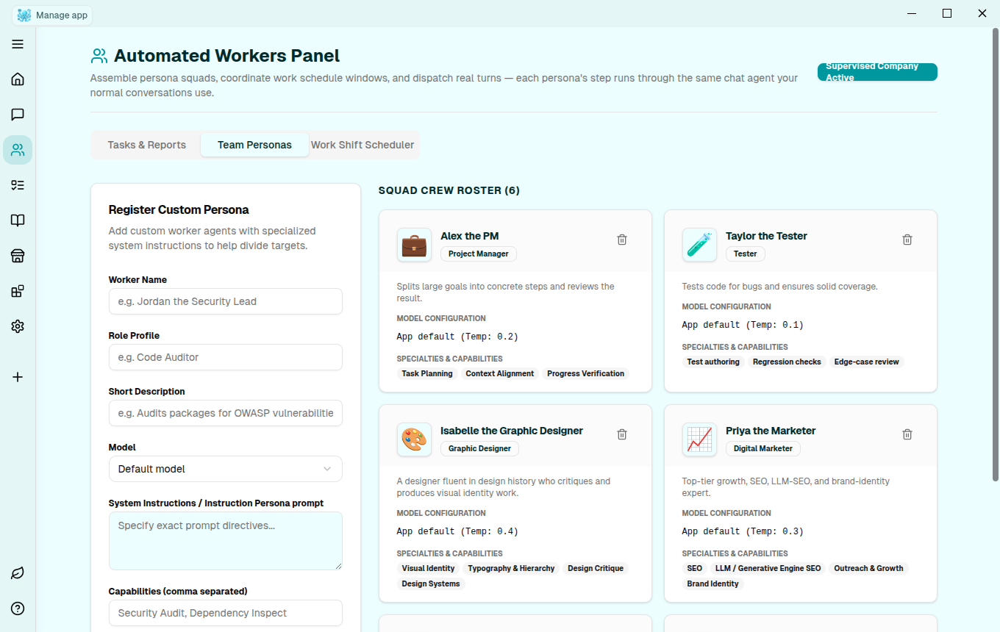
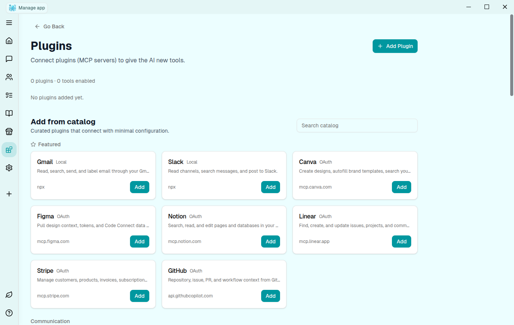
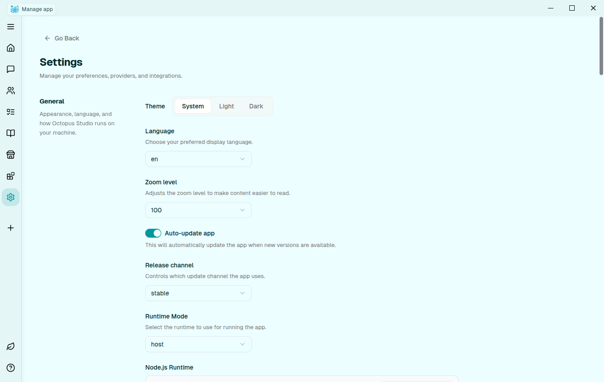

<div align="center">



# Octopus Studio

**A local, open-source AI agentic octopus — your friend, doing everything with its eight hands. Describe what you want, watch it fetch it up from the bottom of the ocean, and ship it yourself.**

[](LICENSE)
[](#download)
[](https://www.electronjs.org/)
[](CONTRIBUTING.md)

[Download](#download) · [Features](#features) · [Getting Started](#getting-started) · [Contributing](#contributing)

</div>

---

Most tools hand you one hand's worth of help. Octopus Studio hands you eight: one arm scaffolds the app while another wires up the plugin you asked for, one keeps a scheduled task running in the background while another reviews the diff a squad of agents just produced. You describe what you want built, it dives down and comes back with the thing — a real, running codebase, not a mockup — and every bit of it happens on your machine. Your code, your API keys, your data, never someone else's server.

<p align="center">
  
</p>

## Features

Eight arms, eight jobs. Here's what each one is doing.

### Build apps by describing them
The first arm sketches the plan and lays the scaffold. Type what you want, pick a template (React, Next.js, or a full-stack starter), and Octopus Studio scaffolds a real project, opens a live preview, and iterates with you turn by turn — every AI edit is committed to a real git history you can branch from or roll back.

### Chat Projects
Not every conversation is about code. Chat Projects are a codeless workspace variant for notes, plans, and research docs, using the same agent and the same chat UI as your coding projects.

### Tasks — scheduled prompts
<p align="center">
  
</p>

An arm that works the night shift. Save a prompt once, run it on demand or on a schedule (hourly, daily, weekly, or a custom interval), against any project. Each run dispatches through the exact same chat agent as a manual message — nothing simulated.

### Workers — multi-persona agent squads
<p align="center">
  
  
</p>

Sometimes one arm isn't enough, so it deputizes. Assemble a squad of personas — a PM, a Solutions Architect, a Tester, a Security Engineer, a Designer, a Marketer — and dispatch a goal. The lead persona plans it, the rest do real turns in a shared chat (real edits, real commits), and the last persona writes the standup report. Cancel a run mid-flight, or open the chat and watch it work.

### Plugins — connect real tools over MCP
<p align="center">
  
</p>

More arms, on demand. Connect real tools through the Model Context Protocol from a bundled catalog of verified, genuinely operating servers — Gmail, Slack, Canva, Notion, Linear, Figma, GitHub, Stripe, Cloudflare, Supabase, and more — with OAuth or a single API key, no hand-written config.

### Bring your own model
It's your ocean; pick the current. Connect OpenAI, Anthropic, Google, or a local model via Ollama/LM Studio. Economy Mode trims context and output for cheaper, faster turns when you don't need the full context window.

### Everything else you'd expect
Visual editing with live preview, local sandboxed execution, one-click GitHub/Vercel/Supabase/Neon integration, and a Settings page with real control over the default model, context limits, and agent permissions.

<p align="center">
  
</p>

## Download

Grab the latest build for your platform from the [Releases](../../releases) page (macOS, Windows, and Linux).

## Getting Started

```bash
git clone https://github.com/kaleemibnanwar/OctopusStudio.git
cd OctopusStudio
npm install
npm start
```

Octopus Studio opens as a desktop app on first launch. Add a model provider API key (or point it at a local Ollama/LM Studio instance) from **Manage AI setup**, and you're building.

### Building a distributable

```bash
npm run make            # build an installer for your current platform
```

See [CONTRIBUTING.md](CONTRIBUTING.md) for the full development workflow, and [AGENTS.md](AGENTS.md) for the architecture notes AI coding agents (and humans) working in this repo should read first.

## Tech stack

Electron · React · TypeScript · TanStack Router · Drizzle ORM (SQLite) · Vite · Tailwind CSS

## Contributing

Contributions are welcome — see [CONTRIBUTING.md](CONTRIBUTING.md) to get set up, and [SECURITY.md](SECURITY.md) to report a vulnerability privately.

## License

Apache License 2.0 — see [LICENSE](LICENSE).
