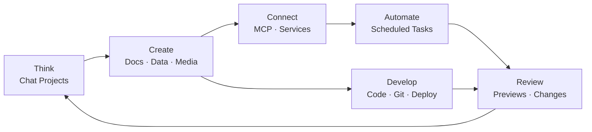
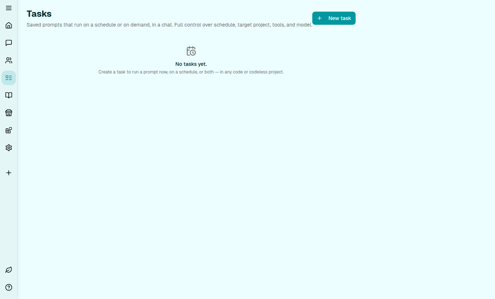
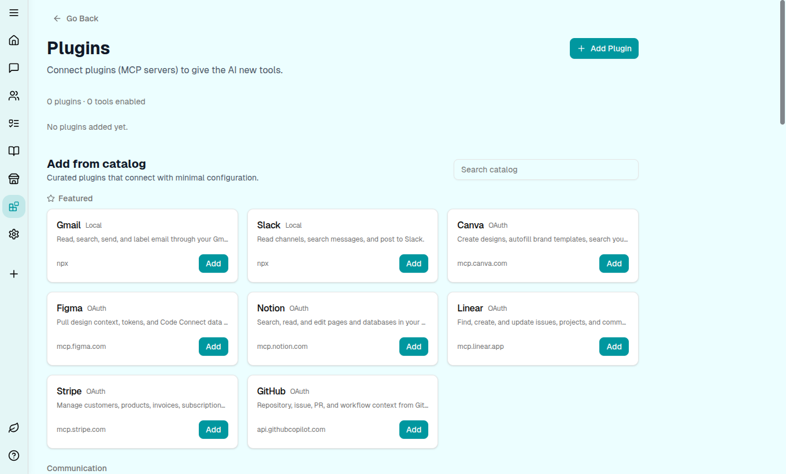
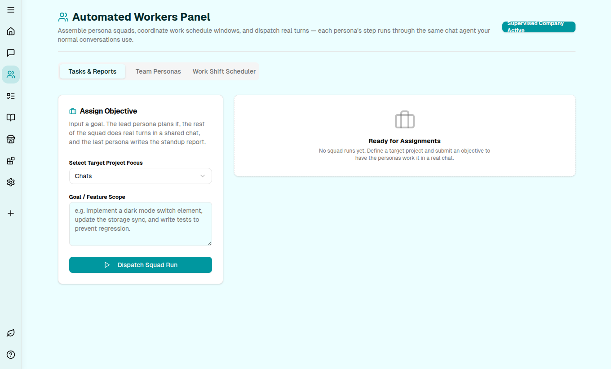

# Octopus Studio

### One local-first AI workspace for the work that refuses to fit in one app.

Research · Documents · Data · Media · Automation · MCP · Development

[Download](#download) · [See what it does](#eight-arms-one-workspace) · [Case studies](docs/CASE_STUDIES.md) · [Compare](docs/COMPARISON.md) · [Tutorials](docs/tutorials/README.md) · [FAQ](docs/FAQ.md)

---

Most AI tools give you a chat box. Octopus Studio gives the work somewhere to live.

Create a codeless research project. Edit the report and spreadsheet beside it. Review images, audio, video, HTML, and presentations. Schedule the next update. Connect real tools through MCP. Route each task to a suitable cloud or local model. And when the work is software, plan it, build it, preview it, version it, and ship it from the same workspace.

**Software development is one arm—not the whole octopus.**

## The 30-second tour

```mermaid
flowchart LR
    A[Think<br/>Chat Projects] --> B[Create<br/>Docs · Data · Media]
    B --> C[Connect<br/>MCP · Services]
    C --> D[Automate<br/>Scheduled Tasks]
    D --> E[Review<br/>Previews · Changes]
    E --> A
    B --> F[Develop<br/>Code · Git · Deploy]
    F --> E
```

Your files remain useful outside Octopus Studio. Cloud models and connected services receive only the context used for their requests; local models are available through Ollama and LM Studio when configured.

## Eight arms, one workspace

| Arm                | What it unlocks                                                                                                  |
| ------------------ | ---------------------------------------------------------------------------------------------------------------- |
| 🔎 **Research**    | Codeless Chat Projects for investigations, planning, notes, and long-running knowledge work.                     |
| 📄 **Documents**   | In-app DOCX and Markdown editing, PPTX preview, and connected report workflows.                                  |
| 📊 **Data**        | XLSX editing and preview for sheets, values, formulas, analysis, and recurring reporting.                        |
| 🎬 **Media**       | Preview images, SVG, audio, and video; search image providers and generate media with configured models.         |
| ⏱️ **Automation**  | Run saved prompts manually or hourly, daily, weekly, or on a custom interval.                                    |
| 🔌 **Connections** | Add MCP tools and connect services such as Google Workspace, GitHub, Vercel, Supabase, and Neon.                 |
| 🧠 **Models**      | Bring supported providers or local models, use automatic routing, and turn on Economy Mode for routine work.     |
| 🛠️ **Development** | Create or import software projects, plan changes, edit files, run tests, preview HTML/apps, use Git, and deploy. |

No single workflow has to use every arm. The point is that your next step is already nearby.

## See it in action

### Automation that returns to real projects

Save a prompt, choose its project, tools, model, and cadence, then inspect each run.

  

### MCP tools without hand-editing configuration

Browse the catalog, connect trusted services, and give the agent only the tools the workflow needs.

  

### Multiple perspectives, one shared objective

Dispatch role-based workers for structured review and coordinated work in a shared project.

  

## What people can do with it

| Workflow                  | Start with                        | Add                                     | Produce                                   |
| ------------------------- | --------------------------------- | --------------------------------------- | ----------------------------------------- |
| **Research management**   | A Chat Project and research skill | MCP sources + scheduled updates         | Evidence log, XLSX data, DOCX report      |
| **Marketing operations**  | Campaign brief                    | Image search/generation + media preview | Calendar, assets, copy, launch deck       |
| **Financial/data review** | An XLSX workbook                  | Controlled analysis + Economy Mode      | Cleaned data, findings, management report |
| **Creator automation**    | Research and editorial skill      | Media + recurring review tasks          | Article, deck, newsletter, video briefs   |
| **Client operations**     | One project per engagement        | Skills + schedules + connected tools    | Repeatable reports and status updates     |
| **Software delivery**     | Existing repo or template         | Plan + agent + tests + preview          | Versioned, deployable project             |

Read the detailed [workflow case studies](docs/CASE_STUDIES.md).

## Why not just use a chat app?

ChatGPT Desktop and Claude Desktop are powerful general assistants. Coding agents are excellent at repositories. Office suites are excellent at individual file formats. Automation platforms connect triggers and actions.

Octopus Studio's bet is different: **the project, its files, its reusable process, its scheduled work, its connected tools, and its model choices should live together.**

| When you care most about…                                                                                     | Consider                        |
| ------------------------------------------------------------------------------------------------------------- | ------------------------------- |
| A broad assistant ecosystem, browser/computer use, and OpenAI models                                          | ChatGPT Desktop                 |
| Anthropic models, Projects, and mature desktop/web connectors                                                 | Claude Desktop                  |
| Deep code-editor ergonomics above everything else                                                             | A dedicated AI IDE/coding agent |
| Specialized office collaboration and enterprise document controls                                             | A traditional office suite      |
| A local-first, model-flexible workspace spanning research, rich files, media, schedules, MCP, and development | **Octopus Studio**              |

See the sourced, capability-by-capability [comparison](docs/COMPARISON.md). No fake “we win every row” table.

## Download

1. Open the [latest release](https://github.com/kaleemibnanwar/OctopusStudio/releases/latest).
2. Read the release notes and choose the asset for your operating system and architecture.
3. Install or extract it, then launch Octopus Studio.
4. Connect a supported cloud provider or local Ollama/LM Studio runtime.
5. Create a Chat Project, open a file, schedule a task, connect an MCP tool, or add a software project.

Availability can vary by platform, release, account, provider, subscription, and connected service.

## Pick a starting point

- **I need recurring research:** [Create a research Chat Project](docs/tutorials/13-chat-projects-for-research.md) → [schedule updates](docs/tutorials/11-scheduled-tasks.md)
- **I work with reports and data:** [Open documents, spreadsheets, and media](docs/tutorials/15-documents-data-and-media.md)
- **I want lower-cost model usage:** [Configure routing and Economy Mode](docs/tutorials/14-model-routing-and-economy.md)
- **I need external tools:** [Connect an MCP plugin](docs/tutorials/09-plugins.md)
- **I have an existing codebase:** [Import it](docs/tutorials/05-import-an-existing-project.md) → [choose a chat mode](docs/tutorials/04-chat-modes-and-permissions.md)
- **I want the full map:** [Features and use cases](docs/FEATURES_AND_USE_CASES.md)

## Privacy, control, and honest boundaries

- Project files and local workspace data are stored on your machine.
- A cloud model receives the prompt and context sent to that provider.
- Local inference can use Ollama or LM Studio, but connected services can still make network requests.
- MCP servers are third-party tools; review permissions, credentials, and consequential actions.
- Keep approval gates on for sensitive commands, external actions, database changes, and unattended tasks.
- Octopus Studio can assist with research, financial/data work, and other professional tasks; qualified human review remains essential.

Read the [FAQ](docs/FAQ.md) for product scope, data flow, formats, and limitations.

## Want the source code?

This repository intentionally contains releases, documentation, and documentation assets—not application source code.

Want Octopus Studio to become open source? Email [kaleemibanwar@gmail.com](mailto:kaleemibanwar@gmail.com?subject=Octopus%20Studio%20source%20request) with the subject **Octopus Studio source request**. If the project receives **100 genuine source-code requests by email**, I will make the source code public.

## Help this project travel

If Octopus Studio matches how you want AI workspaces to evolve:

1. ⭐ Star the repository so others can find it.
2. Download a release and try one complete workflow.
3. Share the [case study](docs/CASE_STUDIES.md) that fits your work.
4. Open an issue with the workflow that would make Octopus Studio indispensable to you.

> **Shareable one-liner:** Octopus Studio is a local-first AI workspace where research, documents, data, media, scheduled tasks, MCP tools, model routing, and software projects live together.
